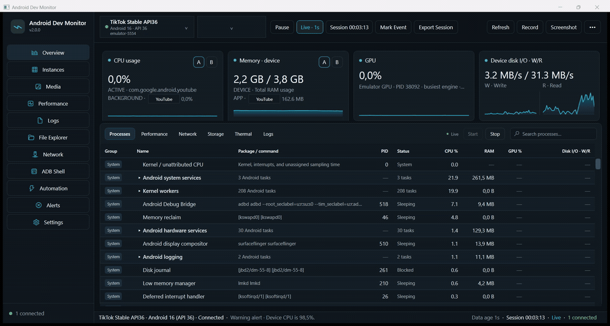
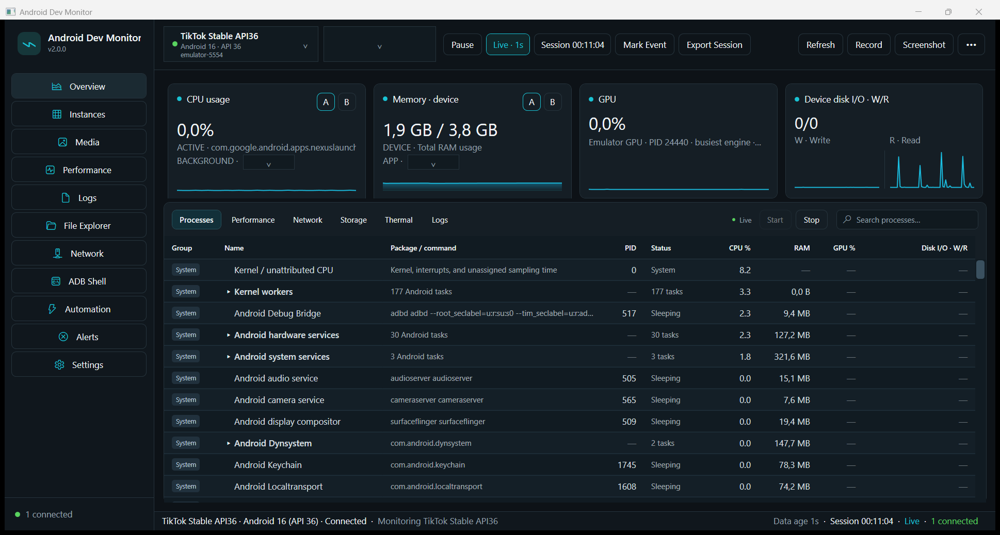

# Android Dev Monitor

[](https://github.com/marko69420/android-dev-monitor/releases/download/v2.5.0/AndroidDevMonitor-v2.5.0-win-x64.zip)

**Ready-to-run Windows app:** [download the ZIP](https://github.com/marko69420/android-dev-monitor/releases/download/v2.5.0/AndroidDevMonitor-v2.5.0-win-x64.zip) → extract it → double-click **`AndroidDevMonitor.exe`**. No installer or .NET SDK required.

**A Windows Task Manager for Android developers.** Monitor Android apps and devices through ADB, correlate performance spikes with actions and logs, and export sessions for debugging beta builds.

**Version 2.5.0** · Windows desktop app · Physical Android devices and local emulators



1. Enable **Developer options → USB debugging** on the Android device, or start a local emulator.
2. Connect the device and accept its USB-debugging prompt.
3. Open Android Dev Monitor and select the detected device.



> [!NOTE]
> Android Dev Monitor is an early preview. Core monitoring, sessions, exports, media capture, logs, file transfer, shell, and automation are implemented, but metric availability depends on the Android version, device vendor, and app permissions.

## Why it exists

Android Dev Monitor helps developers and testers spot expensive user flows without constantly switching between separate ADB tools. Track a package while reproducing a slow screen or action, mark the event, then compare CPU, memory, logical disk I/O, network, frame statistics, thermal state, and logs in the same session.

It is designed for:

- Developers testing beta builds across emulators and physical devices.
- QA teams capturing reproducible performance sessions alongside logs and screenshots.
- Indie developers who want a lightweight Windows dashboard around common ADB workflows.
- Technical users reporting evidence-backed performance bugs to app teams.

## What's new in v2.0.0

- **A/B app monitoring:** follow the application on screen, inspect a selected application's CPU and RAM, and keep total device RAM in view.
- **Readable application selectors:** choose names such as YouTube, Photos, Settings, or your own app from the installed launcher applications. The original package remains available in the tooltip.
- **Emulator GPU monitoring:** read Windows GPU Engine counters for the local Android emulator, with the source identified on the card.
- **Split disk charts:** separate write and read histories, a combined **W/R** value, and explicit B/s, KB/s, or MB/s units. Device-wide `storaged` readings provide a fallback when process I/O is inaccessible.
- **A clearer process table:** System processes first, friendly task names, original packages and commands, aligned metrics, search, and expandable groups. Selecting a group highlights its visible child processes.
- **Start/Stop for the process table:** freeze the current values and row order to inspect a busy list, then resume with the latest measurements.
- **A refreshed dark interface:** maximized startup, compact tabs, readable tooltips, and matching dark scrollbars.

## What's new since v2.5.0

- **Refreshed dark design:** dark check boxes with an accent check, gradient panel surfaces, taller sidebar rows with a gradient selection highlight, accent focus on text fields, and unified toolbar and status bars.

- **Logcat 2.0:** crash/ANR-only mode, bookmarks, "10 seconds before event", persisted filter presets, and a two-row toolbar that is easier to scan.
- **In-app device mirror:** live ADB screencap stream with click-to-tap input, a visible touch marker, frame saving, Windows-clipboard push into the device, and an optional full-speed scrcpy window (scrcpy also forwards device audio on Android 11+).
- **Emulator Control Center:** GPS fix, fold/unfold, dark-mode toggle, font scale, Play Store image detection, full device profile, sensor status, airplane-mode toggle, and snapshot save/load/list/delete.
- **Multi-device lab:** install, launch, screenshot, and logcat across every connected device, one ZIP report, and one scrcpy window per device.
- **Test Runner:** Monkey stress with seed/throttle and a crash verdict, crash/ANR scan, UI Automator hierarchy dump, automatic screenshot + logcat on failure, and ZIP export of all artifacts.
- **App bundle (AAB) analyzer:** modules, DEX, native ABIs, resources, and `BundleConfig.pb`, each with per-module sizes.
- **Companion SDK:** tiny `AdmCompanion.java` plus a `Companion event report` that reads `ADM_COMPANION` markers, value statistics, and a timeline.
- **Background Inspector:** Doze state, App Standby bucket, background restriction, and battery whitelist added to the background work report.
- **Developer productivity:** APK install/update, uninstall, clear data, force stop, cold restart, on-device text typing, device property diff, screenshot pixel diff, and app-data browsing or pulls on debuggable builds.
- **Dark guide and help center:** `docs/USER_GUIDE.html` ships inside the build and opens from the in-app Help page.

## What's new in v2.5.0

- **Wireless Device Center:** mDNS discovery, secure pairing, connect/disconnect, latency checks, reconnect support, and accurate Platform Tools 37 / ADB Wi-Fi 2.0 detection.
- **Developer Lab:** cancellable Perfetto, CPU, frame/jank, GPU, startup, memory, package, permission, background-work, storage, network, logcat, crash/ANR, bugreport, instrumentation, Monkey, emulator, security, capability, and APK reports saved locally.
- **App & Device Lab:** runtime permission controls, AppOps reset, instrumentation test runner, deep-link launcher, ADB port mappings, device keys, emulator simulation controls, scrcpy mirroring, and a multi-device startup/memory matrix.
- **Session comparison:** compare peak CPU, peak memory, average FPS, P95 frame time, and alert counts between two saved sessions.
- **Bug Report Analyzer:** capture or import a bugreport ZIP/TXT and summarize ANRs, crashes, tombstones, watchdog, low-memory, StrictMode, and thermal signals.
- **Build comparison:** inspect APK contents and native ABIs, then compare DEX, resources, native libraries, assets, metadata, and download-size changes between two APKs.
- **AVD lifecycle and test matrix:** list installed AVDs, start, cold boot, stop, perform confirmed wipe-data, simulate common emulator states, and compare startup/memory across connected devices.
- **Background scenario:** automate launch → foreground snapshot → Home → timed background snapshot for the selected package.

## Track an application

Connect a device through ADB and select it in the top bar. The CPU card follows the foreground app automatically. Use the small application selector to choose an app to inspect alongside it; CPU and Memory share this selection.

| Card | A | B |
| --- | --- | --- |
| CPU usage | CPU usage of the application currently on screen | CPU usage of the selected application |
| Memory | Total device RAM used / capacity | RAM used by the selected application's processes (RSS) |

The selected app can be on screen or in the background. Choosing it for monitoring does not launch it. The selectors list apps with launcher activities, including system apps such as Settings.

To open an app on the Android device, use the top **Launch application** dropdown. Its **i** tooltip explains the action; selecting a package launches that app.

## Inspect a busy process list

Use **Stop** beside the search box to freeze the process table at that moment. Values and row order stay still while you search or expand groups. Dashboard monitoring continues. **Start** immediately returns the table to the latest process snapshot.

The **Name** column uses descriptions such as *Disk journal* and *App installer*. The **Package / command** column retains the technical identifiers. Hover over shortened text to read the full value.

## More tools

- Live ADB discovery, device details, normalized CPU measurements, memory, network totals, frame statistics, battery and thermal probes where available.
- 1-second lightweight, 2-second process, and 5-second heavy/discovery sampling targets; actual refresh time depends on device and ADB response times.
- Live/pause sessions, elapsed/active time, markers, editable sustained alert rules, SQLite storage, and JSON/CSV/ZIP export.
- Android screenshot and screen recording capture associated with device, package, and session.
- Instances, Media, Performance, Logs, File Explorer, Network, ADB Shell, Automation, Alerts, and Settings workspaces.
- Deterministic `--demo` mode with a permanent `DEMO DATA` badge and no ADB execution.
- Local operation without a backend or cloud telemetry. Standard monitoring does not require root; metric access depends on the device.

## Prerequisites

- Windows 10/11 x64.
- Optional for live mode: Android SDK Platform Tools. The app resolves a configured path, `ANDROID_SDK_ROOT`, `ANDROID_HOME`, then `PATH`.

The downloadable Windows build is self-contained and does not require .NET. Building from source requires the [.NET 10 SDK](https://dotnet.microsoft.com/download/dotnet/10.0) matching `global.json`.

The app still opens without ADB; use `--demo` to explore it with sample data. Unauthorized devices require accepting the Android USB-debugging prompt. Unavailable measurements appear as `—` in the process table or `N/A` in other views.

## Build and run

```powershell
dotnet restore AndroidDevMonitor.slnx
dotnet build AndroidDevMonitor.slnx -c Debug
dotnet run --project src/AndroidDevMonitor.App/AndroidDevMonitor.App.csproj
dotnet run --project src/AndroidDevMonitor.App/AndroidDevMonitor.App.csproj -- --demo
dotnet test AndroidDevMonitor.slnx -c Debug
dotnet publish src/AndroidDevMonitor.App/AndroidDevMonitor.App.csproj -c Release -r win-x64 --self-contained true -o artifacts/win-x64
```

After publishing:

```powershell
# Normal mode
.\artifacts\win-x64\AndroidDevMonitor.exe

# Demo mode
.\artifacts\win-x64\AndroidDevMonitor.exe --demo
```

Or run `powershell -ExecutionPolicy Bypass -File .\scripts\build-release.ps1`.

## Data and troubleshooting

Local data is under `%LOCALAPPDATA%\AndroidDevMonitor`: SQLite database, diagnostics, media, demo media, sessions, and exports. If ADB is missing, install Platform Tools or set `ANDROID_SDK_ROOT`/`ANDROID_HOME`. If a device is `unauthorized`, accept its debugging prompt. `offline` usually requires reconnecting the device; Refresh performs discovery/collection refresh only and never restarts ADB or a target.

## Project structure

- `src/AndroidDevMonitor.App`: WPF/MVVM shell and dialogs.
- `src/AndroidDevMonitor.Core`: models, contracts, constants, buffers and formatting.
- `src/AndroidDevMonitor.Adb`: argument-safe execution, discovery and tolerant parsers.
- `src/AndroidDevMonitor.Collectors`: live/demo sources and counter calculations.
- `src/AndroidDevMonitor.Infrastructure`: SQLite, exports, media, and Windows emulator GPU counters.
- `tests`: parser, calculation, serialization and bounded-buffer tests.
- `docs`: architecture, metrics, UI behavior, limitations and implementation plan.

## Current limitations

- **GPU scope:** the Windows provider measures the busiest GPU engine of the matching local emulator process. This includes all apps inside that emulator; it is not a per-Android-app GPU percentage. Physical-device GPU monitoring still requires a supported provider.
- **Disk scope:** the card title identifies **App disk I/O** or **Device disk I/O**. The device fallback covers all Android UIDs and may use a longer sampling interval. While a sample is unavailable, the card can show `0/0` and a zero chart baseline; that placeholder does not prove there was no disk activity.
- **App memory:** B shows the sum of process RSS for the selected package. Shared memory can overlap, so adding app RSS values is not equivalent to total device RAM usage.
- **Device permissions:** UID network, process I/O, package storage, filesystem, socket ownership, and frame statistics depend on Android version, vendor, and permissions.
- **Recording:** `screenrecord` support varies by build. Recordings open in the Windows player; the Media page does not decode video thumbnails in-process.

See [metric definitions](docs/METRICS.md), [ADB limitations](docs/ADB_LIMITATIONS.md), and [product notes](docs/PRODUCT_NOTES.md) for more detail.

## License

Android Dev Monitor is available under the [MIT License](LICENSE).
