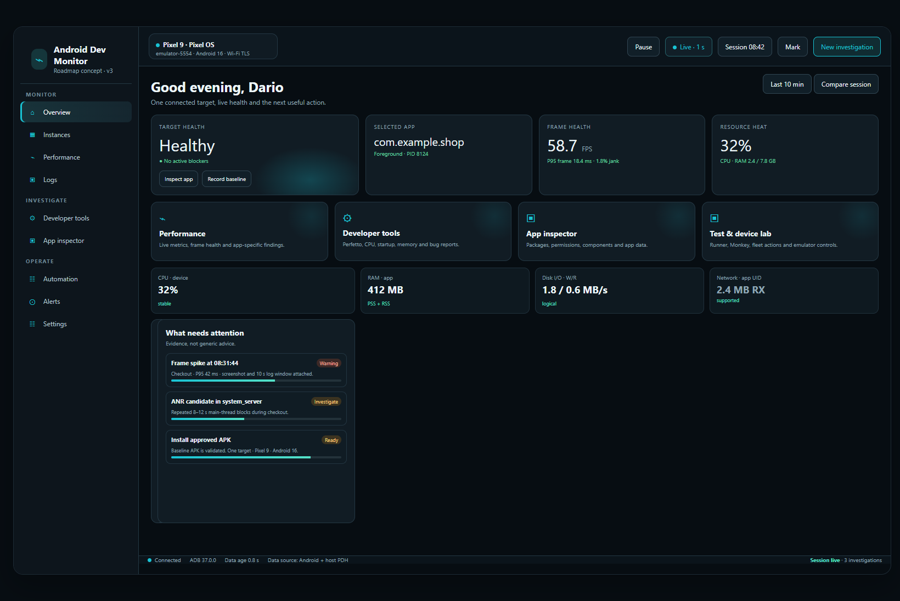
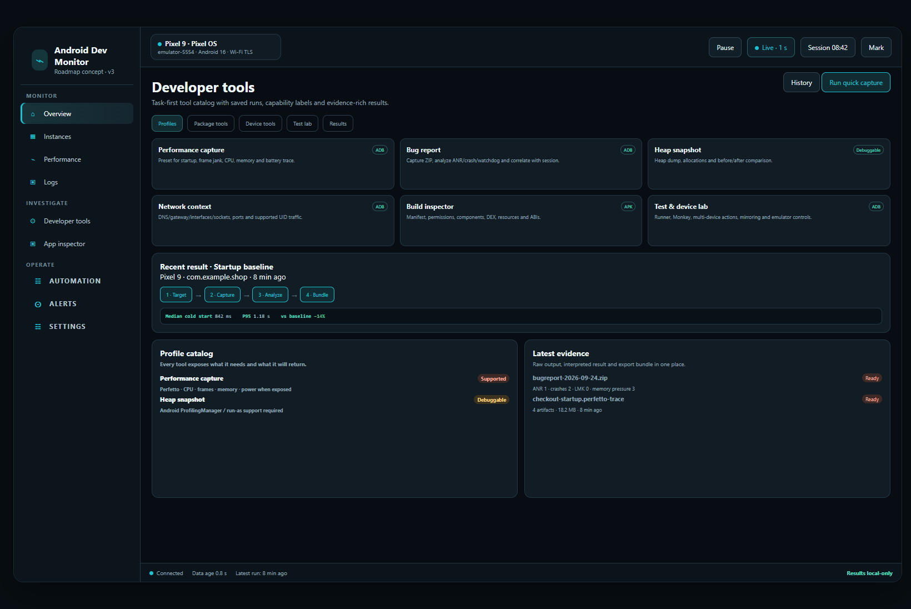
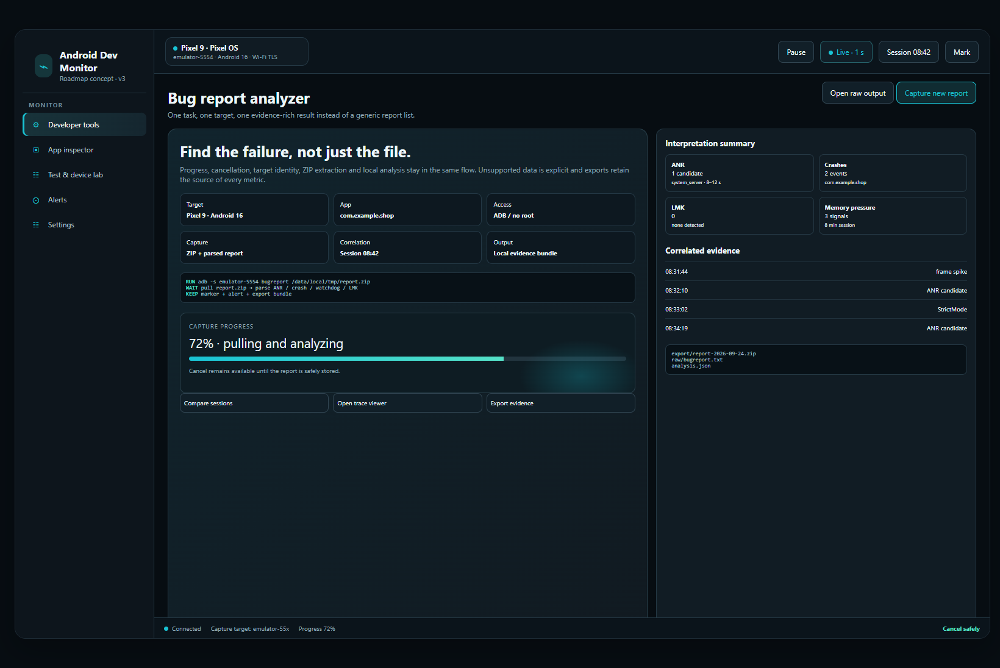

# Android Dev Monitor — v3 product roadmap

**PR scope:** product/UX review, implementation sequence, and visual direction. This PR does not change runtime behavior or claim that the mockups are implemented UI.

**Reviewed:** 24 September 2026 · **Baseline:** `v2.6.1` (`5106c02`) · **Build:** `.NET 10` / WPF / MVVM

## Executive decision

The product is no short of Android diagnostics. The old roadmap’s major capabilities are already present or have a local implementation: wireless ADB, Perfetto/CPU/frame/GPU/startup/memory reports, package and permission inspection, bugreport analysis, APK/AAB analysis, instrumentation/Monkey, mirroring, emulator control, multi-device actions, logs, sessions, exports, and local companion events.

The next release should therefore **not** be another list of unrelated tools. It should make the existing product easier to understand and safer to use:

1. make the Overview problem-aware instead of a dense metric dump;
2. split the overloaded Developer/App & Device navigation into task-oriented workspaces;
3. give every long-running tool a focus mode with progress, cancellation, capability state, and evidence;
4. reduce UI/ViewModel coupling before adding more features;
5. make local data discoverable through workspaces, saved runs, and a compact command palette;
6. keep the explicit `N/A` / unsupported / demo provenance contract that is already a project strength.

## Evidence from the current project

- The solution is intentionally layered: `App` owns WPF composition, `Core` owns records/contracts, `Adb` owns safe execution/parsers, `Collectors` produces live/demo samples, and `Infrastructure` owns SQLite/media/export.
- `MainViewModel.cs` is 5,765 lines and `MainWindow.xaml` is 2,329 lines. The partial files are helpful, but the main view model still owns navigation, process grouping, collection loops, logs, media, files, shell, automation, sessions, alerts, and settings.
- The navigation currently exposes 14 flat pages: `Overview`, `Instances`, `Wireless`, `Developer Tools`, `Media`, `Performance`, `Logs`, `File Explorer`, `Network`, `ADB Shell`, `Automation`, `Alerts`, `Settings`, and `Help`.
- `Developer Tools` and the internal `App & Device Lab` are two high-density workspaces with many independent actions. The current UI gives the user a long list of controls before the result is visible.
- The current behavior is already responsible about capability states: physical-device GPU, app network, protected process data, and vendor metrics can remain unavailable without fabricating values. Keep this invariant.

## What is already implemented

The attached roadmap’s “Status implementation — 9 September 2026” is not a promise for the future; most of it is reflected in the current v2.6.1 source and README. Treat the following as a **feature inventory**, not as the v3 backlog:

| Old roadmap area | Current state | v3 action |
|---|---|---|
| Wireless Device Center | mDNS, secure pairing, connect/disconnect, latency, reconnect, Platform Tools/Wi-Fi detection | Improve discovery health and recent-device UX; do not rebuild the service |
| Perfetto, CPU, RAM, startup, frames, GPU | Developer Lab reports and host-emulator GPU provider | Add profiles, comparison, and evidence presentation |
| Bugreport and Logcat | Bugreport analyzer, presets, bookmarks, time window, Appium import, saves | Add correlation and guided incident mode; retain local-only behavior |
| Package, permissions, background, network | reports, controls, diagnostics, explicit limitations | Turn into a coherent App Inspector workspace |
| APK/AAB analyzer and build comparison | archive analyzers, metadata, ABIs, DEX/resources/assets, comparison | Make install → inspect → compare a single flow |
| Test Runner, Monkey, UI hierarchy | runner, filters/repeats, artifacts, stress, export | Add test plans, pass/fail history, failure evidence |
| Mirroring and emulator controls | in-app screencap mirror, click-to-tap, scrcpy handoff, AVD controls | Add device cockpit and safe action recipes |
| Multi-device lab | install/launch/screenshot/logs/bundle across connected targets | Promote to a first-class fleet workspace |
| Companion SDK and cloud | local companion event parser; no cloud backend | Keep as opt-in later phases; do not mix into the core UX |

## Proposed information architecture

Group navigation by intent rather than by implementation file:

```text
MONITOR
  Overview
  Instances
  Performance
  Logs

INVESTIGATE
  Performance tools
  App inspector
  Test & device lab
  Network & file tools

OPERATE
  Wireless
  Media
  Automation
  Alerts
  Settings
  Help
```

Keep the existing top device/package selectors and session controls. Move specialized controls behind a task-first shell:

- **Overview:** “What needs attention?” plus four large entry cards: Performance, Developer tools, App inspector, Test & device lab.
- **Performance tools:** capture profiles (startup, frame/jank, CPU, memory, battery), then results and comparison.
- **App inspector:** package, permissions, components, app data, build/APK, and permission audit/rollback in one flow.
- **Test & device lab:** instrumentation, Monkey, multi-device actions, mirroring, and emulator controls.
- **Network & file tools:** network diagnostics, ports, ADB Shell, and File Explorer as related transfer/debug surfaces.

## Visual direction

The three concept renders in `docs/product-roadmap/mockups/` are not runtime screenshots. They are visual targets that preserve the current dark cyan identity, explicit status colors, and local-only language.



**Overview concept:** replace metric density with target health, a short attention list, and clear paths into the four most useful workspaces.



**Workspace concept:** present profiles, capability labels, recent results, and raw evidence in a task-first catalog instead of a long toolbar of independent buttons.



**Focus mode concept:** long-running diagnostics get a stable target header, progress/cancel state, interpreted result, correlated session evidence, and a single export action.

## Phased plan

### v2.7 — Orientation and navigation (recommended next release)

**User outcome:** a new user understands the current device/app state in under a minute and can reach the right investigation without scanning every page.

- Add the grouped navigation model and keep a migration alias for the existing page names.
- Add the Overview attention strip: device state, selected app, data freshness, capability warnings, active alerts, and last marker.
- Add a small “start here” flow: connect device → select app → choose a task → save a baseline.
- Make `N/A`, `Unsupported`, `Waiting`, and `Demo` states visually consistent across cards, tables, and tool results.
- Add keyboard shortcuts and a searchable command palette for actions (not just navigation): screenshot, mark, record baseline, open logs, run tool, export.
- Add a compact “recent runs” list to Overview and a “last result” badge to Developer Tools.
- Do not introduce a new metric or cloud dependency in this release.

**Acceptance checks**

- A first-time user can reach each grouped workspace in one click.
- The top-level navigation no longer exposes implementation details as separate destinations.
- Every long-running action shows target, serial, package, state, and cancellation/recovery behavior.
- Existing demo mode and unsupported metric behavior remain unchanged.

### v2.8 — Evidence-first tool flows

**User outcome:** a developer can run a diagnostic and understand the result without opening several files or translating raw ADB output manually.

- Introduce a `RunContext` model (device, package, session, capability state, command provenance, cancellation token).
- Add named capture profiles: startup, frame/jank, CPU, memory, battery/thermal, network, and bugreport.
- Add a result envelope: status, progress, raw output path, interpreted findings, warnings, and export bundle.
- Move bugreport, Perfetto, startup, and frame/jank into a focus workspace.
- Correlate a finding with the active session marker, log window, screenshot, and nearby samples.
- Add saved result history with device/package/session metadata and an explicit local retention policy.
- Keep deep commands in a safe, target-bound form; show the exact target before execution.

**Acceptance checks**

- No result is presented as healthy when its source is unsupported or stale.
- Every report can be reopened after restart without losing provenance.
- Cancel/timeout states are visible and do not masquerade as success.
- A bugreport or startup run can be exported with raw output plus interpretation.

### v2.9 — App and build workflow

**User outcome:** a developer can inspect a build, change a permission or app state, run a test, and compare evidence without switching to a separate command line.

- Create App Inspector navigation: package details, components, permissions/AppOps, app data, build/APK/AAB, and device properties.
- Add permission-change audit/rollback as a first-class timeline with before/after state and target.
- Make APK/AAB drag-and-drop, install, inspect, and compare a single guided flow.
- Add test plans and saved instrumentation filters; show pass/fail/flaky history per target.
- Add screenshot diff and startup baseline as reusable comparison recipes.
- Promote companion events to an optional, clearly labeled data source; no cloud upload by default.

**Acceptance checks**

- A permission action displays the exact package, serial, old state, new state, and rollback availability.
- APK/AAB analysis records build metadata and the source path.
- A test result links to logs, screenshot, UI hierarchy, and session marker where available.
- Unsupported debuggable-only data is labeled before the user starts a run.

### v3.0 — Device cockpit and extensibility

**User outcome:** the product feels like a focused Android developer cockpit for both one device and a small device fleet.

- Add device cockpit: screen mirror, device keys, clipboard, deep links, ports, battery/network/emulator state, and safe action recipes.
- Make multi-device matrix a primary workspace with synchronized captures and a single evidence bundle.
- Add optional local companion SDK instrumentation: custom markers, startup, recomposition, request timing, and background work events.
- Add Perfetto/trace viewer handoff and richer session comparison (baseline, current, delta).
- Consider cloud integrations only after local data export, privacy behavior, and offline operation are proven.

**Acceptance checks**

- Multi-device actions remain bound to captured serials/packages even if UI selection changes.
- Mirror input never targets a different device than the displayed frame.
- Companion and cloud data are visibly attributed and opt-in.
- Local-only operation remains the default and works without account setup.

## Smallest implementation slices

Each slice should be a reviewable PR rather than a broad rewrite:

1. `ui/navigation-groups`: add grouped navigation plus aliases; no behavior changes.
2. `overview/attention-strip`: derive attention items from existing alerts, stale data, capabilities, and session markers.
3. `workspace/app-inspector`: extract the existing App & Device Lab controls into a focused shell without changing commands.
4. `workspace/test-device-lab`: extract mirroring, runner, Monkey, emulator, and fleet controls into a coherent task view.
5. `tools/run-context`: add target/progress/cancellation/result contracts for long-running tools.
6. `tools/profiles-and-history`: add saved capture profiles and result history.
7. `evidence/correlation`: connect findings to session markers, log windows, screenshots, and exports.
8. `viewmodel/decompose`: move process/log/media/file/session/alerts state into focused view models/services; keep `MainViewModel` as a composition coordinator.
9. `performance/perf-light`: profile dispatcher/UI updates, chart rendering, batched persistence, and log throughput under a realistic 10-minute capture.
10. `testing/contract-tests`: add navigation, cancellation, stale target, capability, and export integration tests around the new shells.

## Engineering risks and non-goals

- **Do not rewrite ADB first.** The current safe execution, cancellation, per-device gates, parser tests, and explicit unsupported states are assets.
- **Do not turn the app into a cloud dashboard in v3.0.** Local operation, privacy, and offline use are differentiators.
- **Do not label host GPU, logical process I/O, or app UID totals as universal device/app metrics.** Keep source and availability in UI and exports.
- **Do not expose a second global device selector.** Preserve the single selected-device context and bind long-running actions to captured serials.
- **Do not add more flat pages before decomposing the current one.** The code already has 14 navigation destinations and a 5,765-line main view model.
- **Do not treat a mockup as implemented functionality.** The images are direction and acceptance references only.

## How we review each phase

For every implementation PR, include:

- before/after screenshots at the same window size;
- keyboard-only path and empty/loading/unsupported/cancel states;
- a real demo-mode run and a targeted live-device check where applicable;
- tests for stale target, cancellation, source/provenance, and export behavior;
- a short note on what is intentionally not supported on physical devices or emulators.

## Immediate next step

Start with **v2.7 / `ui/navigation-groups` + `overview/attention-strip`**. It delivers visible value without changing ADB semantics, gives the product a clearer identity, and creates a safe foundation for the evidence-first workspaces planned above.

## Source notes

- Current product behavior: `docs/ARCHITECTURE.md`, `docs/UI_BEHAVIOR.md`, `docs/ADB_LIMITATIONS.md`, `README.md`, and the v2.6.1 release notes.
- Current implementation: `src/AndroidDevMonitor.App/MainWindow.xaml`, `src/AndroidDevMonitor.App/ViewModels/MainViewModel*.cs`, `src/AndroidDevMonitor.Core/Services/Contracts.cs`.
- Visual targets: `docs/product-roadmap/mockups/01-overview-concept.png`, `02-workspaces-concept.png`, `03-focus-mode-concept.png`.
- Baseline verification on this review: `dotnet test AndroidDevMonitor.slnx --no-restore --nologo` → 69/69 tests passed (40 ADB, 23 Core, 6 Collectors).
